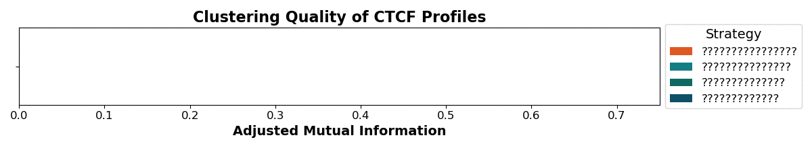
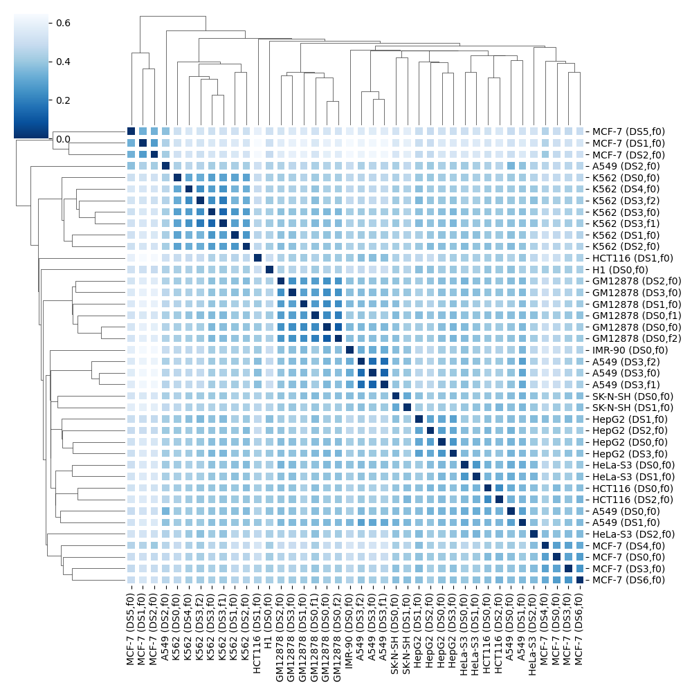

# Bin ChIP-seq peaks before applying hierarchical clustering!

According to the results presented in our research paper (link is coming) the clustering quality can significantly be improved when applying further postprocessing to peak profiles from ChIP-seq. This processing, in particular, is called binning and describes the process of cutting the genome into adjacent non-overlapping windows *bins* that are annotated if there is an overlapping peak. 

On a set of 40 CTCF profiles from the ENCODE data portal, taken as an example here, we show that a bin-based clustering results in a three-fold higher adjusted mutual information, a clustering evaluation metric, compared to using the peak regions. For other ChIP-targets we also observed improved clsutering quality when bins are used. 



The code for running the clustering based on the default peaks or applying the binning prior to clustering is provided by this repository. 

If you'd like to set up an anaconda environment for using the software from this repsotivory, you can do so by running the following line based on an Anaconda installation:

```
conda env create -f chip.yml
```

At the bottom of this README, we discuss in detail other installation strategies. In short, having a Python 3 installation including the packages *scikit-learn, pandas* and *seaborn*, together with bedtools, should do it.

## Running Examples

Run ```python binNclusterChIP.py --help``` to print detailed information about the parameters.

The script takes a table in tsv format in which the profiles are described together with a file path for each profile in bed file-format. This table must have the columns **ID**, **filePath** and **name**. The ID is used e.g. to access the binned profile files that are created by the script and saved into files. The *name* is shown in the clustermap and the *filePath* is used to read in the peak regions for a certain profile. An example for CTCF is provided by "CTCF_files.tsv". The column **label** is optional. However, if you can label your profiles, then the agglomerative clustering is also evaluated and the corresponding scores are printed to the console. 

With the following line one can create a clustermap based on the peaks. Jaccard-Distances are automatically computed. 

```
python binNclusterChIP.py -p CTCF_files.tsv -t peaks -o ./example_CTCF/
```

When using bins, one has to define the reference genome and the bin size:

```
python binNclusterChIP.py -p CTCF_files.tsv -t bins -g GRCh38 -s 5kb -o ./example_CTCF/
```

**BED files must ALWAYS be SORTED before running the script!** 

You can use *bedtools* to sort your peak files (see [here](https://bedtools.readthedocs.io/en/latest/content/tools/sort.html))

### Expected Output

The script produces a *clustermap* describing the result of the hierarchical clustering. Here the *clustermap* as a result of the second example run:



An example for the text printed to *stdout* is provided by this LOG file: [./example_CTCF/LOG.txt](./example_CTCF/LOG.txt)

## Runtime

It can take a moment to derive the bins from the provided peak files. Based on the CTCF example provided here, we observed on average approx. 30 seconds per profile for a 5kb binning. Hence, approx. 20 minutes for 40 profiles. For the binning on 2kb resolution the time increases to approx. 1 minute per profile. 

However, once the bins are derived from the peaks, computing the Jaccard-Distance it much faster compared to computing the Jaccard-Distance between peak files.

Runtimes were measured on a local machine with an Intel® Core™ i7-10510U CPU @ 1.80GHz 2.30 GHz.

Note that the runtime strongly depends on the CPU of your machine. Another test, we ran on the provided CTCF example, showed that the **5kb binning** can be done within **less than 15 seconds per profile** when using a single thread of an AMD Ryzen™ 9 5900X

## Installation Guidelines

The code is written in Python for Linux systems. Indeed, everything was developed under WSL (Windows Subsystem for Linux) which we highly recommend for Windows users.

Most of the Python packages required for this tool, are commonly used in the NGS community. Additionally, one might has to install *bedtools*. However, we provide some tips for setting up an Anaconda environment that has evrything needed to run the main script.

### Anaconda environment

If you like to use Anaconda, you might simply install bedtools (we tested the code on version 2.30.0, however other versions probably work, too). 

However, apply the following steps to create your own environment and add the required packages. This was working perfectly fine on Ubuntu 20.04.5 LTS with Anaconda 22.11.1 

For installing the most recent Anaconda, which we recommend anyways, we refer to the straighforward 3-step installation described on the official [Anaconda website](https://docs.anaconda.com/anaconda/install/linux/)

```
conda create -n chip python=3.9 anaconda pandas scikit-learn

source ~/.bashrc
conda activate chip

conda config --add channels defaults
conda config --add channels conda-forge
conda config --add channels bioconda

conda install -c bioconda bedtools
conda install -c anaconda seaborn
```

Note that users who already use scikit-learn and seaborn, might only need to install *bedtools* to an excisting environment. 


